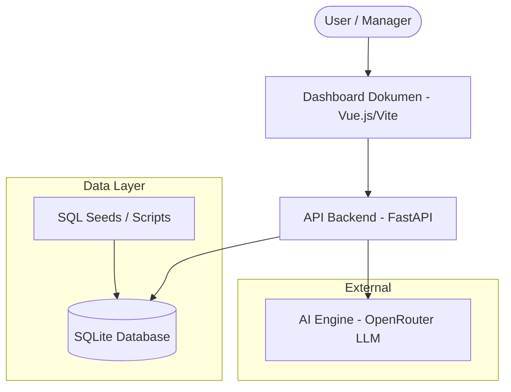
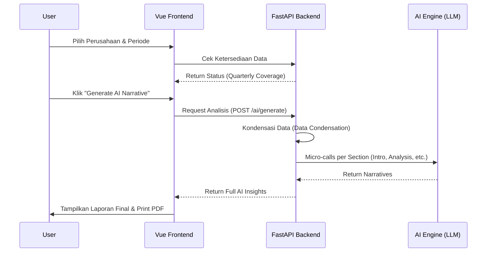
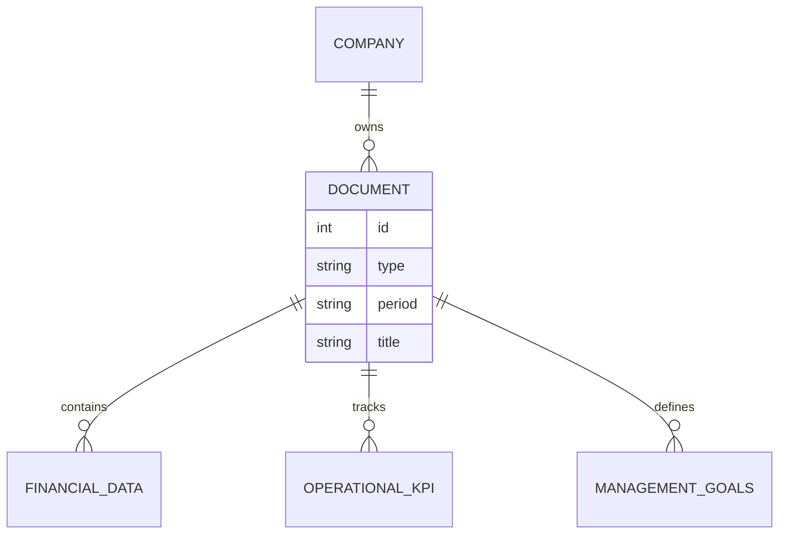

# AI Automated Document Reporting System

Sistem pelaporan otomatis berbasis AI yang mengintegrasikan data keuangan, operasional, dan manajemen untuk menghasilkan laporan profesional secara instan.

## 🌟 Fitur Utama

- **Penyusunan Otomatis**: Menghasilkan laporan Keuangan, Operasional, dan Manajemen dengan satu klik.
- **AI-Driven Analysis**: Analisis naratif yang mendalam menggunakan LLM (OpenRouter) berdasarkan data riil.
- **Gaya Laporan Terintegrasi**: Desain laporan yang bersih, profesional, dan siap cetak (A4).
- **Manajemen Perusahaan**: Mendukung banyak profil perusahaan dengan data yang terisolasi.
- **Pratinjau Data**: Melakukan audit data sumber (API) sebelum menghasilkan narasi AI.

## 🏗️ Arsitektur Sistem

Sistem ini terdiri dari tiga komponen utama: Frontend (Vue.js), Backend (FastAPI), dan Database (SQLite/SQL Seeds).



## 📂 Struktur Proyek

- **`/backend`**: REST API menggunakan FastAPI, SQLAlchemy sebagai ORM, dan integrasi AI client.
- **`/dashboard-dokumen`**: Antarmuka pengguna (Frontend) menggunakan Vue 3, Vite, dan Tailwind CSS.
- **`/data`**: Kumpulan script SQL dan script python untuk migrasi dan seeding data contoh.

## 🔄 Alur Kerja Pembuatan Dokumen



## 🛠️ Persiapan Lingkungan

### Backend
1. Masuk ke direktori backend: `cd backend`
2. Instal dependensi: `pip install -r requirements.txt`
3. Konfigurasi `.env`:
   ```env
   OPENROUTER_API_KEY=your_key_here
   DATABASE_URL=sqlite:///./ai_writer.db
   ```
4. Jalankan server: `uvicorn app.main:app --reload`

### Frontend
1. Masuk ke direktori: `cd dashboard-dokumen`
2. Instal dependensi: `npm install`
3. Jalankan development server: `npm run dev`

### Data Seeding
Gunakan file di folder `/data` untuk mengisi database awal:
`cat data/seeds_quarterly_complete.sql | sqlite3 backend/ai_writer.db`

## 📊 Model Data (ERD Ringkas)



## 📝 Catatan Tambahan
Semua narasi yang dihasilkan AI telah disetel untuk bersifat faktual, to-the-point, dan bebas dari filler teks (seperti "Berikut adalah contoh..."). Laporan ini dirancang untuk kebutuhan manajerial perusahaan Indonesia.
