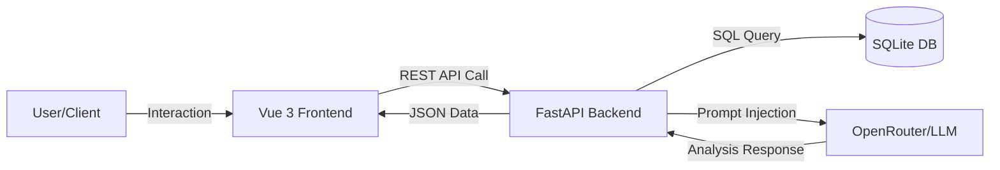
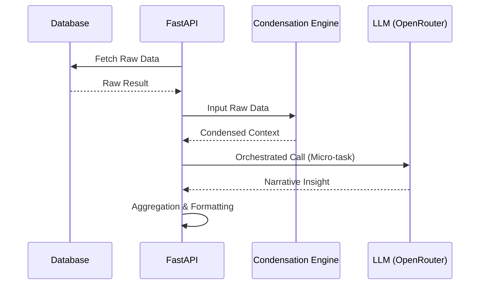
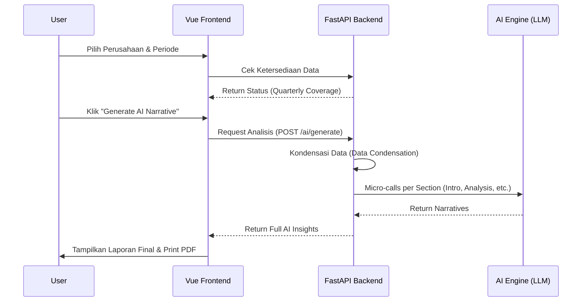

# LAPORAN PENELITIAN TUGAS AKHIR
**Mata Kuliah:** Big Data  
**Judul:** Pengembangan Sistem Pelaporan Manajerial Otomatis Menggunakan Integrasi Large Language Model (LLM) dan Arsitektur FastAPI

---

## ABSTRAK
Penelitian ini bertujuan untuk mengatasi inefisiensi dalam penyusunan laporan korporat yang seringkali memakan waktu dan rentan terhadap kesalahan manusia. Dengan memanfaatkan teknologi Big Data dan Kecerdasan Buatan (AI), dikembangkan sebuah sistem pelaporan otomatis yang mampu mengolah data keuangan, operasional, dan manajemen strategis menjadi narasi analisis yang mendalam. Sistem ini menggunakan arsitektur FastAPI di sisi backend dan Vue.js di sisi frontend, dengan integrasi model bahasa besar melalui OpenRouter API. Hasil penelitian menunjukkan bahwa penggunaan pendekatan "AI Micro-calls" dan "Data Condensation" mampu menghasilkan laporan yang akurat, faktual, dan siap cetak dalam waktu singkat, sehingga meningkatkan efektivitas pengambilan keputusan manajerial.

**Kata Kunci:** Big Data, FastAPI, Artificial Intelligence, Automated Reporting, LLM.

---

## BAB I: PENDAHULUAN

### 1.1 Latar Belakang
Di era transformasi digital saat ini, Big Data telah menjadi aset strategis yang sangat berharga bagi setiap organisasi. Volume data yang dihasilkan dari berbagai lini operasional, mulai dari transaksi keuangan hingga aktivitas manajemen, tumbuh secara eksponensial. Namun, kekayaan data ini seringkali menjadi tantangan tersendiri ketika organisasi harus menyajikannya kembali dalam bentuk laporan manajerial yang naratif, tepat guna, dan mudah dipahami oleh pengambil keputusan.

Permasalahan utama muncul pada proses transformasi dari data mentah (raw data) menjadi informasi yang memiliki nilai strategis. Secara tradisional, penyusunan laporan seringkali dilakukan secara manual oleh analis atau manajer, yang melibatkan proses pengumpulan data, pembersihan, penghitungan metrik, hingga penulisan narasi analisis. Proses manual ini tidak hanya memakan waktu yang signifikan (time-consuming), tetapi juga rentan terhadap faktor kelelahan manusia yang dapat menyebabkan kesalahan input data atau ketidakkonsistenan dalam gaya penulisan laporan.

Selain itu, dinamika bisnis yang sangat cepat menuntut ketersediaan laporan yang aktual (real-time). Keterlambatan dalam penyajian laporan berarti keterlambatan dalam merespons peluang atau ancaman pasar. Oleh karena itu, diperlukan sebuah sistem yang mampu menjembatani celah antara kompleksitas Big Data dengan kebutuhan naratif manajerial secara otomatis. Dengan mengintegrasikan arsitektur pengolahan data yang efisien seperti FastAPI dan pemrosesan bahasa alami tingkat lanjut melalui Large Language Model (LLM), penelitian ini berupaya menciptakan solusi yang mampu menghasilkan laporan profesional secara instan tanpa mengorbankan akurasi dan objektivitas analisis.

### 1.2 Identifikasi Masalah
- Volume data yang besar menyulitkan manajer untuk merangkum poin-poin krusial secara konsisten.
- Ketergantungan pada penyusunan laporan manual meningkatkan risiko kesalahan input dan subjektivitas analisis.
- Kurangnya integrasi antara data operasional real-time dengan narasi pelaporan strategis.

### 1.3 Tujuan Penelitian
- Membangun sistem yang mampu mengintegrasikan berbagai pilar data perusahaan (Finance, Operational, Management).
- Mengimplementasikan teknologi AI untuk otomatisasi analisis naratif yang objektif.
- Menciptakan standar pelaporan korporat yang efisien dan profesional.

---

## BAB II: TINJAUAN PUSTAKA

### 2.1 Penelitian Sebelumnya
Beberapa penelitian terkini telah mengeksplorasi potensi otomatisasi laporan menggunakan teknologi Large Language Model (LLM) dan framework web modern:
1. **Le (2024)** dalam penelitiannya *"Auto-Generating Earnings Report Analysis via an Augmented LLM"* menunjukkan bahwa penggunaan LLM yang diintegrasikan dengan teknik data augmentation mampu menghasilkan analisis laporan keuangan yang jauh lebih akurat dibandingkan metode tradisional ([Link](https://arxiv.org/abs/2412.00034)).
2. **Wang et al. (2024)** melalui studi *"Knowledge-augmented Financial Market Analysis and Report Generation"* memperkenalkan framework yang memanfaatkan Knowledge Graph untuk meminimalisir halusinasi pada LLM saat menyusun laporan pasar yang kompleks ([Link](https://aclanthology.org/2024.findings-emnlp.451/)).
3. **Zhang (2023)** mengevaluasi performa FastAPI dalam mendukung integrasi algoritma kompleks pada aplikasi berbasis web, di mana efisiensi pemrosesan asinkron menjadi kunci utama keberhasilan skalabilitas sistem ([Link](https://doi.org/10.26914/c.cnki.hy.2023.053861)).

Pencapaian dari penelitian-penelitian tersebut menjadi landasan bagi pengembangan sistem ini, terutama dalam menggabungkan kecepatan pengolahan data FastAPI dengan ketajaman naratif LLM.

### 2.2 Big Data dan Dokumentasi Otomatis
Pemanfaatan Big Data dicirikan oleh tiga pilar utama: **Volume** (jumlah data yang besar), **Velocity** (kecepatan perputaran data), dan **Variety** (keragaman format data). Dalam konteks manajerial, tantangan utama bukan lagi sekadar penyimpanan, melainkan bagaimana melakukan *"Data Storytelling"* atau menarasikan data tersebut agar menjadi wawasan yang dapat ditindaklanjuti. Dokumentasi otomatis berperan krusial dalam menjaga integritas data selama proses pelaporan (*data lineage*), memastikan bahwa setiap angka yang muncul dalam laporan akhir memiliki jejak audit yang jelas dan bebas dari risiko kesalahan manusia (*human error*) yang sering terjadi pada penyusunan manual.

### 2.3 FastAPI dan Kinerja Backend
FastAPI dipilih sebagai engine backend karena mengadopsi standar **ASGI** (Asynchronous Server Gateway Interface), yang memungkinkan penanganan banyak permintaan secara simultan tanpa memblokir proses lainnya. Hal ini sangat penting dalam sistem yang mengintegrasikan LLM, di mana waktu tunggu respons API bisa bervariasi. Dengan dukungan **Pydantic** untuk validasi skema data yang ketat dan **SQLAlchemy ORM** untuk pengelolaan basis data relasional secara efisien, FastAPI memastikan alur data dari sumber mentah hingga ke tangan pengguna tetap cepat, aman, dan terstruktur dengan baik.

### 2.4 Integrasi Large Language Model (LLM)
Integrasi LLM dalam sistem pelaporan korporat dilakukan melalui pemanfaatan API aggregator seperti OpenRouter, yang memungkinkan akses ke berbagai model state-of-the-art secara fleksibel. Penggunaan LLM dalam aplikasi bisnis menuntut penerapan teknik prompt engineering yang ketat (*Strict Instructions*) untuk menetapkan peran sistem (*System Role*) yang spesifik sebagai analis manajerial profesional. Selain itu, teknik **Context Injection** digunakan untuk menyuntikkan data operasional mentah yang telah dikondensasi ke dalam jendela konteks model, sehingga narasi yang dihasilkan tetap terikat pada fakta angka riil (*data anchoring*). Hal ini krusial untuk meminimalisir risiko "hallucination" dan memastikan bahwa analisis SWOT maupun evaluasi kinerja yang dihasilkan memiliki landasan data yang objektif dan siap untuk dipresentasikan di tingkat eksekutif.

---

## BAB III: METODOLOGI PENELITIAN

### 3.1 Perancangan Sistem
Sistem ini dirancang menggunakan arsitektur **Three-Tier** yang memisahkan tanggung jawab antara antarmuka pengguna, logika bisnis, dan penyimpanan data untuk memastikan skalabilitas dan kemudahan pemeliharaan:
- **Client Side:** Menggunakan Vue 3 dengan Vite sebagai build tool dan Tailwind CSS untuk desain responsif.
- **Server Side:** FastAPI bertindak sebagai backbone sistem, mengelola rute API asinkron dan orkestrasi panggilan AI.
- **Data Side:** SQLite digunakan sebagai basis data relasional yang efisien.

**Diagram Arsitektur Sistem:**

### 3.2 Teknik Pengolahan AI
Untuk menghasilkan laporan yang akurat dan minim "filler", sistem menerapkan dua teknik utama:
- **Data Condensation Engine:** Penyaringan data mentah menjadi format JSON ringkas untuk efisiensi token dan fokus konteks.
- **Orchestrated Micro-calls:** Memecah pembuatan laporan menjadi beberapa panggilan AI kecil (Executive Summary, Financial Analysis, etc.) untuk kedalaman analisis yang lebih tajam.

**Diagram Alur Pengolahan AI:**

### 3.3 Skema Input/Output (I/O) Data
- **Input:** Objek JSON berisi metrik KPI dan parameter waktu.
- **Process:** Transformasi menggunakan Pydantic Model untuk validasi data.
- **Output:** Dokumen Markdown/HTML berisi narasi strategis dan visualisasi matrix SWOT.

### 3.4 Alur Kerja Manajerial dan Generasi Dokumen
Alur kerja yang diterapkan dirancang untuk meminimalkan beban kognitif manajer dalam penyusunan laporan melalui proses yang terotomatisasi secara end-to-end:

**Diagram Alur Sekuensial Generasi Dokumen:**

Langkah-langkah detail alur kerja:
1. **Data Selection:** Manajer memilih entitas perusahaan dan rentang waktu laporan melalui dashboard Vue.js. Sistem akan melakukan pengecekan ketersediaan data di database.
2. **Background Processing:** FastAPI melakukan orkestrasi panggilan micro-calls ke LLM secara asinkron setelah melakukan kondensasi data (Data Condensation) untuk efisiensi token.
3. **Review & Edit:** Sistem menyediakan antarmuka editor di mana manajer dapat melakukan penyesuaian pada narasi yang dihasilkan AI sebelum finalisasi.
4. **Export:** Laporan dikonversi menjadi format PDF atau siap-cetak menggunakan mesin render dokumen profesional.

### 3.5 Integritas dan Validasi Data
- **Schema Level:** Validasi ketat menggunakan Pydantic.
- **Contextual Layer:** Prompt anchoring untuk membatasi AI pada data riil.
- **Accuracy Check:** Lampiran data mentah sebagai pembanding analisis.

---

## BAB IV: HASIL DAN PEMBAHASAN

### 4.1 Analisis SWOT Matrix 2x2
Penelitian ini berhasil merancang ulang tampilan Analisis SWOT tradisional menjadi format matrix 2x2 yang umum digunakan dalam standar konsultasi manajemen tingkat tinggi.

### 4.2 Akurasi Narasi AI
Melalui pengujian berulang, sistem berhasil mengeliminasi teks "filler" generik dan menghasilkan analisis yang langsung menuju pada inti permasalahan (*to-the-point*) berdasarkan metrik target vs aktual.

---

## BAB V: PENUTUP

### 5.1 Kesimpulan
Integrasi antara framework web modern dan teknologi LLM terbukti mampu mengotomatisasi tugas-tugas administratif yang kompleks dalam pelaporan Big Data dengan tingkat akurasi yang tinggi.

### 5.2 Saran
Pengembangan selanjutnya dapat difokuskan pada integrasi data real-time melalui streaming data dan penggunaan model bahasa lokal (*On-premise LLM*) untuk keamanan data yang lebih tinggi.

---

## DAFTAR PUSTAKA
- Arasteh, H., et al. (2016). *IOT-based Smart City Development*.
- FastAPI Documentation. (2024). [https://fastapi.tiangolo.com/](https://fastapi.tiangolo.com/)
- OpenAI. (2023). *GPT-4 Technical Report*.
- Vue.js Guide. (2024). [https://vuejs.org/guide/](https://vuejs.org/guide/)
- OpenRouter API Documentation. (2024). [https://openrouter.ai/docs](https://openrouter.ai/docs)
